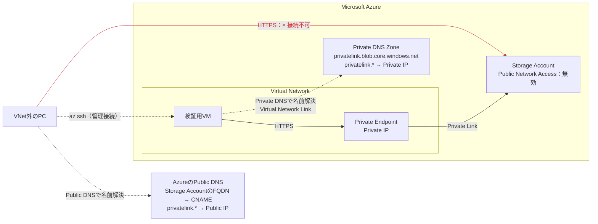
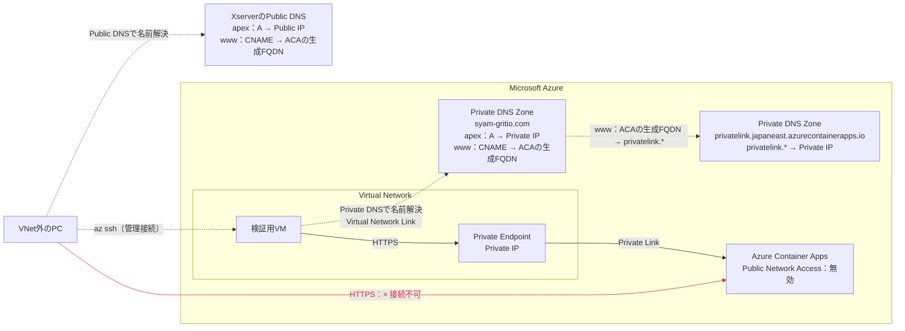

# azure-split-brain-dns-lab

Zennの[初級編（Storage Account）](https://zenn.dev/gritio28tech/articles/d60ab47c81934f)と[中級編（Azure Container Appsのカスタムドメイン）](https://zenn.dev/gritio28tech/articles/441d92f09287b8)で検証した、Azure Private Endpointとsplit-brain DNSの構成をIaCで再現するリポジトリです。

現在はTerraform版を利用できます。Bicep版は今後追加予定です。

## 構成概要

### 初級編：Storage Account

Azureサービスの既定FQDNが、VNet内外で異なるIPアドレスへ名前解決される基本動作を確認します。



### 中級編：Azure Container Appsのカスタムドメイン

カスタムドメインのapexとサブドメインを扱い、同名のPrivate DNS Zoneが必要になる構成を確認します。



## ディレクトリ構成

```text
.
├── terraform/
│   ├── main.tf
│   ├── local.tf
│   ├── providers.tf
│   ├── versions.tf
│   └── backend.tf
├── bicep/              # 今後追加予定
├── README.md
└── LICENSE
```

> Azureリソースには料金が発生する場合があります。検証後は削除してください。

## 前提条件

- Terraform `1.16.x`
- Azure CLIでAzureへログイン済み
- Azureリソースを作成できる権限
- SSH公開鍵
- 自分で管理しているカスタムドメイン
- Public DNSへA、CNAME、TXTレコードを登録できること

Public DNSはXserver Domainで手動設定します。Terraformの管理対象には含まれません。

## Terraformで工夫したこと

- 構築を`base → certificate → private`の3段階に分けています。Public DNSの手動設定を挟み、公開アクセスが有効な状態でマネージド証明書を作成してから、公開アクセスを無効にしてPrivate Endpointを作成するためです。コードをコメントアウトせず、`deployment_phase`の指定だけで段階を切り替えられます。
- VMのSSH公開鍵はコードへ直書きせず、`ssh_public_key_path`で指定したローカルファイルから読み込みます。秘密鍵はTerraformで管理しません。
- 削除時は、カスタムドメインから証明書の紐付けを解除してからマネージド証明書を削除します。これにより、`CertificateInUse`エラーを避けて一度の`terraform destroy`で削除できます。

## 1. 設定

Azure CLIでログインし、Terraformが使用するサブスクリプションを環境変数に設定します。

```bash
az login
az account set --subscription "<サブスクリプションIDまたは名前>"
export ARM_SUBSCRIPTION_ID="$(az account show --query id --output tsv)"
export ARM_TENANT_ID="$(az account show --query tenantId --output tsv)"
```

VM管理者のロールは、ここでログインしたユーザーへ割り当てられます。続いて、`terraform/local.tf`を自分の環境に合わせて変更します。

```hcl
locals {
  resource_group_name = "<作成するリソースグループ名>"
  region              = "japaneast"
  ssh_public_key_path = "~/.ssh/id_rsa.pub"
  my_custom_domain    = "example.com"
}
```

初級編のStorage Accountも作成する場合は、次の値を`true`にします。

```hcl
enable_split_brain_dns_beginner = true
```

## 2. 作成

Azure側の制約とPublic DNSの手動設定があるため、`base → certificate → private`の順に進めます。

### base

```bash
cd terraform
terraform init
terraform validate

terraform plan -var='deployment_phase=base' -out='base.tfplan'
terraform apply "base.tfplan"
```

Public DNSへ登録する値を確認します。

```bash
az containerapp env show --resource-group <リソースグループ名> --name cae-dev --query properties.staticIp --output tsv
az containerapp show --resource-group <リソースグループ名> --name ca-dev-nginx --query properties.configuration.ingress.fqdn --output tsv
az containerapp show --resource-group <リソースグループ名> --name ca-dev-nginx --query properties.customDomainVerificationId --output tsv
```

次のレコードをPublic DNSへ手動登録します。

| 名前 | 種類 | 値 |
| --- | --- | --- |
| `@` | A | Container Apps環境のStatic IP |
| `www` | CNAME | Container Appの生成FQDN |
| `asuid` | TXT | Custom Domain Verification ID |
| `asuid.www` | TXT | Custom Domain Verification ID |

### certificate

```bash
terraform plan -var='deployment_phase=certificate' -out='certificate.tfplan'
terraform apply -parallelism=1 "certificate.tfplan"
```

### private

```bash
terraform plan -var='deployment_phase=private' -out='private.tfplan'
terraform apply "private.tfplan"
```

## 3. 動作確認

VNet外ではPublic DNSで名前解決できますが、HTTPS接続は失敗します。

```bash
curl -sS -o /dev/null -w 'RemoteIP: %{remote_ip}\nHTTPStatus: %{http_code}\n' https://www.<カスタムドメイン>
curl -sS -o /dev/null -w 'RemoteIP: %{remote_ip}\nHTTPStatus: %{http_code}\n' https://<カスタムドメイン>
```

検証用VMへ接続します。

```bash
az ssh vm --resource-group <リソースグループ名> --name vm-dev-ssh --local-user azureuser
```

VNet内では、3つの名前が最終的にPrivate EndpointのPrivate IPへ名前解決され、HTTPSで接続できます。

```bash
sudo resolvectl flush-caches

dig +noall +answer <Container Appの生成FQDN>
dig +noall +answer www.<カスタムドメイン>
dig +noall +answer <カスタムドメイン>

curl -sS -o /dev/null -w 'RemoteIP: %{remote_ip}\nHTTPStatus: %{http_code}\n' https://<確認するホスト名>
```

初級編のStorage Accountも作成した場合は、次の形式で確認します。Private IPへ接続できていれば、Blob APIから`400`が返ってもネットワーク疎通は成功です。

```bash
dig +noall +answer <Storage Account名>.blob.core.windows.net
curl -sS -o /dev/null -w 'RemoteIP: %{remote_ip}\nHTTPStatus: %{http_code}\n' https://<Storage Account名>.blob.core.windows.net
```

最後にTerraformとの差分がないことを確認します。

```bash
terraform plan -var='deployment_phase=private'
```

## 4. 削除

```bash
terraform destroy -var='deployment_phase=private'
terraform state list
```

`terraform state list`で何も表示されなければ完了です。Public DNSのレコードはTerraformで削除されないため、不要になったらXserver Domain側で削除します。
