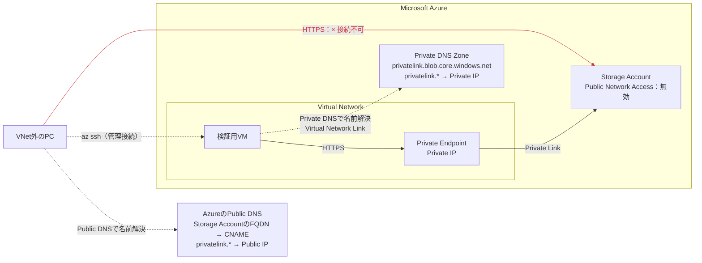
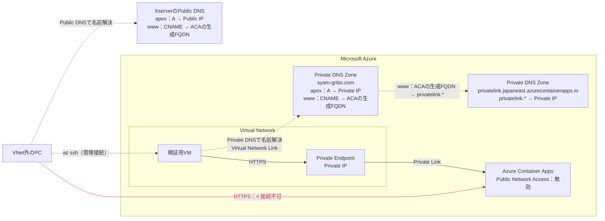
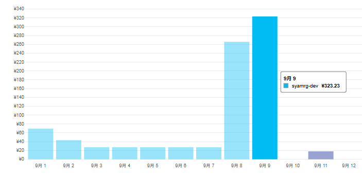

# azure-split-brain-dns-lab

Zennの[初級編（Storage Account）](https://zenn.dev/gritio28tech/articles/d60ab47c81934f)と[中級編（Azure Container Appsのカスタムドメイン）](https://zenn.dev/gritio28tech/articles/441d92f09287b8)で検証した、Azure Private Endpointとsplit-brain DNSの構成をIaCで再現するリポジトリです。

Terraform版とBicep版を用意しています。

- [Terraform版の使い方](./terraform/README.md)
- [Bicep版の使い方](./bicep/README.md)

## 検証構成

### 初級編：Storage Account

Azureサービスの既定FQDNが、VNet内外で異なるIPアドレスへ名前解決される基本動作を確認します。



### 中級編：Azure Container Appsのカスタムドメイン

カスタムドメインのapexとサブドメインを扱い、同名のPrivate DNS Zoneが必要になる構成を確認します。



## TerraformとBicepを使った感想

今回の構成を両方で作成・削除した、個人的な感想です。

| 観点 | Terraform | Bicep |
| --- | --- | --- |
| 差分確認 | `plan`で確認したい変更を追いやすい | What-Ifのノイズが多く、変更点が埋もれやすい |
| 既存環境のIaC化 | importと`-generate-config-out`を起点にコードを調整できる | Portalから取得したテンプレートをそのまま使えない場合がある |
| 状態管理 | stateの管理が必要 | stateやimportが不要 |
| 証明書のバインド | AzAPIで紐付けと解除を実装した | `bindingType: 'Auto'`で自動化できた |
| 削除 | `terraform destroy`でまとめて削除できる | 今回はリソースグループごと削除する |
| 今回の印象 | コードと差分を読みやすく、検証を進めやすかった | 関係のない既存リソースも再評価される点が不便だった |

個人的には、Microsoft製品中心の企業でも、人の入れ替わりがある現場では、共通言語にしやすいTerraformでインフラIaCを書く方がよいと改めて思いました。

今回Bicepに軍配が上がったと感じたのは、マネージド証明書とカスタムドメインのバインドを`Auto`にできた点です。stateやimportが不要な点と、ARM APIのバージョンを直接指定できる点も利点ですが、今回は大きな恩恵を実感しませんでした。

## 検証費用



今回はすべてのリソースを数時間ずつ稼働させながら、1日で初級編・中級編の検証を行い、費用は約323円でした。構成や稼働時間によって変わりますが、1日で検証する場合は200〜300円台が目安です。

## ディレクトリ構成

```text
.
├── terraform/          # Terraform版と固有のREADME
├── bicep/              # Bicep版、パラメーターファイル、固有のREADME
├── docs/images/        # READMEで使用する画像
├── README.md
└── LICENSE
```

Public DNSはXserver Domainで手動設定します。IaCの管理対象には含まれないため、検証後はAzureリソースだけでなく、不要になったPublic DNSレコードも削除してください。
